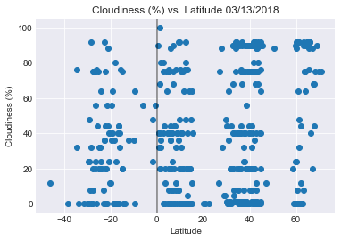
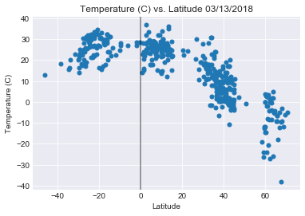
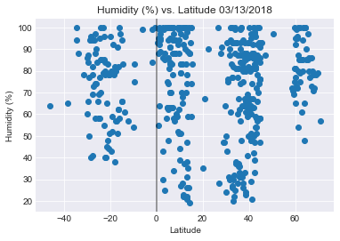

## Unit 6 | Assignment - What's the Weather Like?

## Background

Whether financial, political, or social -- data's true power lies in its ability to answer questions definitively. So let's take what you've learned about Python requests, APIs, and JSON traversals to answer a fundamental question: "What's the weather like as we approach the equator?"

Now, we know what you may be thinking: _"Duh. It gets hotter..."_ 

But, if pressed, how would you **prove** it? 


## WeatherPy

In this example, you'll be creating a Python script to visualize the weather of 500+ cities across the world of varying distance from the equator. To accomplish this, you'll be utilizing a [simple Python library](https://pypi.python.org/pypi/citipy), the [OpenWeatherMap API](https://openweathermap.org/api), and a little common sense to create a representative model of weather across world cities.

Your objective is to build a series of scatter plots to showcase the following relationships:

* Temperature (F) vs. Latitude
* Humidity (%) vs. Latitude
* Cloudiness (%) vs. Latitude
* Wind Speed (mph) vs. Latitude

Your final notebook must:

* Randomly select **at least** 500 unique (non-repeat) cities based on latitude and longitude.
* Perform a weather check on each of the cities using a series of successive API calls. 
* Include a print log of each city as it's being processed with the city number, city name, and requested URL.
* Save both a CSV of all data retrieved and png images for each scatter plot.

As final considerations:

* You must use the Matplotlib libraries.
* You must include a written description of three observable trends based on the data. 
* You must use proper labeling of your plots, including aspects like: Plot Titles (with date of analysis) and Axes Labels.
* You must include an exported markdown version of your Notebook called  `README.md` in your GitHub repository.  
* See [Example Solution](WeatherPy_Example.pdf) for a reference on expected format. 

## Hints and Considerations

* You may want to start this assignment by refreshing yourself on 4th grade geography, in particular, the [geographic coordinate system](http://desktop.arcgis.com/en/arcmap/10.3/guide-books/map-projections/about-geographic-coordinate-systems.htm). 

* Next, spend the requisite time necessary to study the OpenWeatherMap API. Based on your initial study, you should be able to answer  basic questions about the API: Where do you request the API key? Which Weather API in particular will you need? What URL endpoints does it expect? What JSON structure does it respond with? Before you write a line of code, you should be aiming to have a crystal clear understanding of your intended outcome.

* You may have to install the [citipy Python library](https://pypi.python.org/pypi/citipy). You can do this from Git Bash (or the Anaconda terminal) by typing the command `pip install citipy`

* Though we've never worked with the [citipy Python library](https://pypi.python.org/pypi/citipy), push yourself to decipher how it works, and why it might be relevant. Before you try to incorporate the library into your analysis, start by creating simple test cases outside your main script to confirm that you are using it correctly. Too often, when introduced to a new library, students get bogged down by the most minor of errors -- spending hours investigating their entire code -- when, in fact, a simple and focused test would have shown their basic utilization of the library was wrong from the start. Don't let this be you!

* Part of our expectation in this challenge is that you will use critical thinking skills to understand how and why we're recommending the tools we are. What is Citipy for? Why would you use it in conjunction with the OpenWeatherMap API? How would you do so?

* In building your script, pay attention to the cities you are using in your query pool. Are you getting coverage of the full gamut of latitudes and longitudes? Or are you simply choosing 500 cities concentrated in one region of the world? Even if you were a geographic genius, simply rattling 500 cities based on your human selection would create a biased dataset. Be thinking of how you should counter this. (Hint: Consider the full range of latitudes).

* Lastly, remember -- this is a challenging activity. Push yourself! If you complete this task, then you can safely say that you've gained a strong mastery of the core foundations of data analytics and it will only go better from here. Good luck!

## Copyright

Coding Boot Camp (C) 2016. All Rights Reserved.


```python
import matplotlib
import matplotlib.pyplot as plt
import pandas as pd
import requests
import numpy as np
from citipy import citipy 
from config import api_key
import matplotlib
import matplotlib.pyplot as plt
import seaborn as sns
import random
from requests import request
from pprint import pprint
import csv
```


```python
url = "http://api.openweathermap.org/data/2.5/weather"

app_id = api_key

params = { "appid" :app_id,"units":"metric" }
```


```python
weather_response = requests.get(url,params=params)
cityweather = weather_response.json()
```


```python
#every key I generate returned a 403 or 400 error so I read in a csv to create a df of the samples that were called when I ran an API call from a different computer using another api key
pprint (weather_response)
```

    <Response [400]>


```python
# latitude_zone = np.arange(-90,90,15)
# longitude_zone = np.arange(-180,180,15)
```


```python
# cityweather_df = pd.DataFrame()
# cityweather_df["Lat"] = ""
# cityweather_df["Lon"] = ""
```


```python
# for x in latitude_zone:
#     for y in longitude_zone:
#         x_values = list(np.arange(x,x+15,0.01))
#         y_values = list(np.arange(y,y+15,0.01))
#         lats = random.sample(x_values,500)
#         lons = random.sample(y_values,500)
#         lat_samples = [(x+dec_lat) for dec_lat in lats]
#         lon_samples = [y+dec_lon for dec_lon in lons]
#         cityweather_df = cityweather_df.append(pd.DataFrame.from_dict({"Lat":lat_samples,
#                                        "Lon":lon_samples}))   
# cityweather_df = cityweather_df.reset_index(drop=True)
```


```python
# cityweather_df["Closest City name"] = ""
# cityweather_df["Closest Country code"] = ""
# for index,row in cityweather_df.iterrows():
#     city = citipy.nearest_city(row["Latitude"],row["Longitude"])
#     cityweather_df.set_value(index,"Closest City name",city.city_name)
#     cityweather_df.set_value(index,"Closest Country code",city.country_code)
```


```python
# filtered_cities_df = cityweather_df.drop(['Latitude', 'Longitude'],axis=1)
# filtered_cities_df = filtered_cities_df.drop_duplicates()
```


```python
# selected_cities = filtered_cities_df.sample(500)

# selected_cities = selected_cities.reset_index(drop=True)
```


```python
# for index,row in selected_cities.iterrows():
#     params["q"] =f'{row["Closest City name"]},{row["Closest Country code"]}'
#     print(f"Retrieving weather information for {params['q']}")
#     city_weather_resp = requests.get(base_url,params)
#     print(encrypt_key(city_weather_resp.url))
#     city_weather_resp  = city_weather_resp.json()
#     cityweather_df.set_value(index,"Latitude",city_weather_resp.get("coord",{}).get("lat"))
#     cityweather_df.set_value(index,"Longitude",city_weather_resp.get("coord",{}).get("lon"))
#     cityweather_df.set_value(index,"Temperature",city_weather_resp.get("main",{}).get("temp_max"))
#     cityweather_df.set_value(index,"Wind speed",city_weather_resp.get("wind",{}).get("speed"))
#     cityweather_df.set_value(index,"Humidity",city_weather_resp.get("main",{}).get("humidity"))
#     cityweather_df.set_value(index,"Cloudiness",city_weather_resp.get("clouds",{}).get("all"))
```


```python
cityweather_csv= "city_weather.csv"
 
cityweather_df = pd.read_csv("city_weather.csv")

cityweather_df.head()
```


<div>
<style>
    .dataframe thead tr:only-child th {
        text-align: right;
    }

    .dataframe thead th {
        text-align: left;
    }

    .dataframe tbody tr th {
        vertical-align: top;
    }
</style>
<table border="1" class="dataframe">
  <thead>
    <tr style="text-align: right;">
      <th></th>
      <th>Unnamed: 0</th>
      <th>Closest City name</th>
      <th>Closest Country code</th>
      <th>Latitude</th>
      <th>Longitude</th>
      <th>Temperature</th>
      <th>Wind speed</th>
      <th>Humidity</th>
      <th>Cloudiness</th>
    </tr>
  </thead>
  <tbody>
    <tr>
      <th>0</th>
      <td>0</td>
      <td>chakwal</td>
      <td>pk</td>
      <td>32.93</td>
      <td>72.86</td>
      <td>15.16</td>
      <td>3.51</td>
      <td>100.0</td>
      <td>68.0</td>
    </tr>
    <tr>
      <th>1</th>
      <td>1</td>
      <td>nakasongola</td>
      <td>ug</td>
      <td>1.32</td>
      <td>32.46</td>
      <td>20.36</td>
      <td>2.86</td>
      <td>92.0</td>
      <td>68.0</td>
    </tr>
    <tr>
      <th>2</th>
      <td>2</td>
      <td>barra velha</td>
      <td>br</td>
      <td>-26.63</td>
      <td>-48.68</td>
      <td>26.00</td>
      <td>5.10</td>
      <td>74.0</td>
      <td>75.0</td>
    </tr>
    <tr>
      <th>3</th>
      <td>3</td>
      <td>mosquera</td>
      <td>co</td>
      <td>4.71</td>
      <td>-74.23</td>
      <td>18.00</td>
      <td>6.20</td>
      <td>63.0</td>
      <td>40.0</td>
    </tr>
    <tr>
      <th>4</th>
      <td>4</td>
      <td>trat</td>
      <td>th</td>
      <td>12.25</td>
      <td>102.51</td>
      <td>26.21</td>
      <td>2.31</td>
      <td>100.0</td>
      <td>92.0</td>
    </tr>
  </tbody>
</table>
</div>


```python
import time
date = time.strftime("%m/%d/%Y")

```


```python
plt.scatter(cityweather_df['Latitude'], cityweather_df['Cloudiness'])
plt.axvline(0, color='black',alpha=0.5)
plt.title(f"Cloudiness (%) vs. Latitude {date}")
plt.xlabel("Latitude")
plt.ylabel("Cloudiness (%)")
plt.style.use("seaborn-darkgrid")
plt.savefig("Cloudiness.png")
plt.show()
```





The cloudiness % as you approach the equator is seemingly equally as random as the cloudiness % going away from the equator as well


```python
plt.scatter(cityweather_df['Latitude'],cityweather_df['Temperature'],s=25)
plt.axvline(0, color='black',alpha=0.5)
plt.title(f"Temperature (C) vs. Latitude {date}")
plt.xlabel("Latitude")
plt.ylabel("Temperature (C)")
plt.style.use("seaborn-darkgrid")
plt.savefig("Temperature.png")
plt.show()
```





The farther you move away from the equator cities tend to show a sharp decline in degrees (C) as you can see below


```python
plt.scatter(cityweather_df['Latitude'], cityweather_df['Humidity'])
plt.axvline(0, color='black',alpha=0.5)
plt.title(f"Humidity (%) vs. Latitude {date}")
plt.xlabel("Latitude")
plt.ylabel("Humidity (%)")
plt.style.use("seaborn-darkgrid")
plt.savefig("Humidity.png")
plt.show()
```





Humidity near the equator is possibly just a small bit higher at most but is still relatively unnoticable and probably would just be safer to say that there is not correlation between the equator and humidity in the cities around the world
